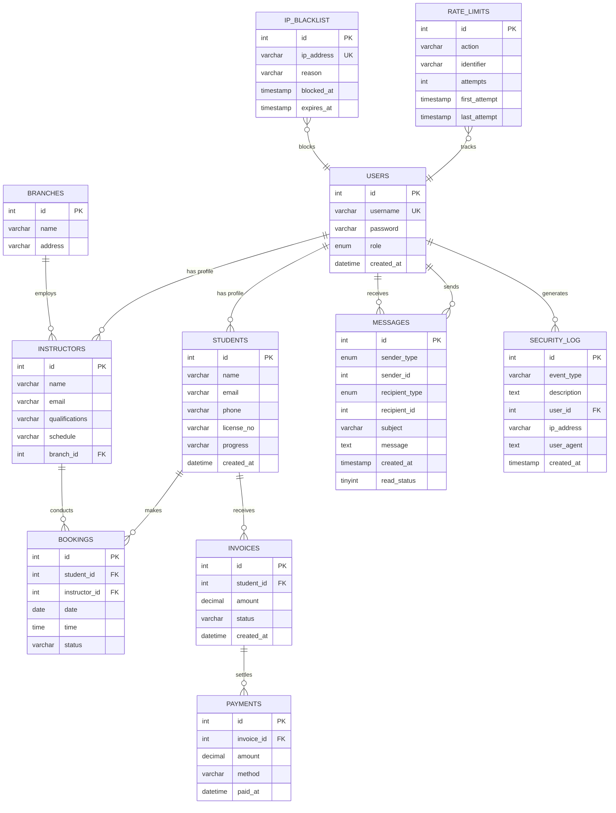

# Origin Driving School - Database Entity Relationship Diagram (ERD)

**Project:** Origin Driving School Management System  
**Course:** DWIN309 - Developing Web-based Information System  
**Institution:** Kent Institute Australia  
**Team Members:**
- Ms Isha Shrestha (K241002)
- Mr Rojan Shrestha (K240867)
- Mr Rasik Tiwari (K240750)

---

## Database Overview

The Origin Driving School database consists of **12 tables** that manage students, instructors, bookings, payments, messaging, and security features.

### Database Name: `origin_driving_school`
### Database Engine: MariaDB 10.4.32

---

## ERD Diagram (Mermaid Syntax)



---

## Detailed Table Descriptions

### 1. **USERS** (Authentication & Authorization)
- **Purpose:** Central authentication table for all system users
- **Primary Key:** `id`
- **Unique Key:** `username`
- **Relationships:**
  - One user can have one student profile
  - One user can have one instructor profile
  - One user can send/receive many messages

| Column | Type | Constraints | Description |
|--------|------|-------------|-------------|
| id | INT(11) | PRIMARY KEY, AUTO_INCREMENT | Unique user identifier |
| username | VARCHAR(50) | UNIQUE, NOT NULL | Login username |
| password | VARCHAR(255) | NOT NULL | Hashed password (bcrypt) |
| role | ENUM('admin','student','instructor') | NOT NULL | User role/type |
| created_at | DATETIME | DEFAULT CURRENT_TIMESTAMP | Account creation date |

---

### 2. **STUDENTS** (Student Management)
- **Purpose:** Store student profiles and learning progress
- **Primary Key:** `id`
- **Relationships:**
  - Links to USERS table (implicit via username/email)
  - One student can have many bookings
  - One student can have many invoices

| Column | Type | Constraints | Description |
|--------|------|-------------|-------------|
| id | INT(11) | PRIMARY KEY, AUTO_INCREMENT | Unique student identifier |
| name | VARCHAR(100) | NULL | Student full name |
| email | VARCHAR(100) | NULL | Contact email |
| phone | VARCHAR(20) | NULL | Contact phone number |
| license_no | VARCHAR(50) | NULL | Driver's license number |
| progress | VARCHAR(255) | NULL | Learning stage/progress |
| created_at | DATETIME | DEFAULT CURRENT_TIMESTAMP | Registration date |

**Progress States:**
- "Profile Setup Required"
- "Getting Started"
- "Registered"
- "Theory Complete"
- "Practical Scheduled"
- "Test Ready"
- "Licensed"

---

### 3. **INSTRUCTORS** (Instructor Management)
- **Purpose:** Store instructor profiles and schedules
- **Primary Key:** `id`
- **Foreign Key:** `branch_id` → BRANCHES(id)
- **Relationships:**
  - One instructor belongs to one branch
  - One instructor can have many bookings

| Column | Type | Constraints | Description |
|--------|------|-------------|-------------|
| id | INT(11) | PRIMARY KEY, AUTO_INCREMENT | Unique instructor identifier |
| name | VARCHAR(100) | NULL | Instructor full name |
| email | VARCHAR(100) | NULL | Contact email |
| qualifications | VARCHAR(255) | NULL | Certifications/qualifications |
| schedule | VARCHAR(255) | NULL | Working hours/availability |
| branch_id | INT(11) | FOREIGN KEY | Branch assignment |

---

### 4. **BRANCHES** (Location Management)
- **Purpose:** Manage driving school locations
- **Primary Key:** `id`
- **Relationships:**
  - One branch can have many instructors

| Column | Type | Constraints | Description |
|--------|------|-------------|-------------|
| id | INT(11) | PRIMARY KEY, AUTO_INCREMENT | Unique branch identifier |
| name | VARCHAR(100) | NULL | Branch name |
| address | VARCHAR(255) | NULL | Physical address |

---

### 5. **BOOKINGS** (Lesson Scheduling)
- **Purpose:** Manage lesson bookings and scheduling
- **Primary Key:** `id`
- **Foreign Keys:** 
  - `student_id` → STUDENTS(id)
  - `instructor_id` → INSTRUCTORS(id)

| Column | Type | Constraints | Description |
|--------|------|-------------|-------------|
| id | INT(11) | PRIMARY KEY, AUTO_INCREMENT | Unique booking identifier |
| student_id | INT(11) | FOREIGN KEY | Student making booking |
| instructor_id | INT(11) | FOREIGN KEY | Assigned instructor |
| date | DATE | NULL | Lesson date |
| time | TIME | NULL | Lesson time |
| status | VARCHAR(50) | NULL | Booking status |

**Status Values:**
- "Pending" - Awaiting confirmation
- "Confirmed" - Approved and scheduled
- "Completed" - Lesson finished
- "Cancelled" - Cancelled by student/instructor

---

### 6. **INVOICES** (Financial Billing)
- **Purpose:** Generate and track student invoices
- **Primary Key:** `id`
- **Foreign Key:** `student_id` → STUDENTS(id)
- **Relationships:**
  - One invoice can have many payments

| Column | Type | Constraints | Description |
|--------|------|-------------|-------------|
| id | INT(11) | PRIMARY KEY, AUTO_INCREMENT | Unique invoice identifier |
| student_id | INT(11) | FOREIGN KEY | Student being billed |
| amount | DECIMAL(10,2) | NULL | Total invoice amount |
| status | VARCHAR(50) | NULL | Payment status |
| created_at | DATETIME | DEFAULT CURRENT_TIMESTAMP | Invoice generation date |

**Status Values:**
- "Unpaid" - Outstanding balance
- "Paid" - Fully settled
- "Partial" - Partially paid
- "Overdue" - Past due date

---

### 7. **PAYMENTS** (Payment Processing)
- **Purpose:** Record payment transactions
- **Primary Key:** `id`
- **Foreign Key:** `invoice_id` → INVOICES(id)

| Column | Type | Constraints | Description |
|--------|------|-------------|-------------|
| id | INT(11) | PRIMARY KEY, AUTO_INCREMENT | Unique payment identifier |
| invoice_id | INT(11) | FOREIGN KEY | Associated invoice |
| amount | DECIMAL(10,2) | NULL | Payment amount |
| method | VARCHAR(50) | NULL | Payment method |
| paid_at | DATETIME | NULL | Payment timestamp |

**Payment Methods:**
- "Cash"
- "Credit Card"
- "Debit Card"
- "Bank Transfer"
- "PayPal"

---

### 8. **MESSAGES** (Internal Communication)
- **Purpose:** Enable messaging between users (students, instructors, admin)
- **Primary Key:** `id`
- **Indexes:** 
  - `idx_recipient` on (recipient_type, recipient_id)
  - `idx_sender` on (sender_type, sender_id)
  - `idx_created` on created_at

| Column | Type | Constraints | Description |
|--------|------|-------------|-------------|
| id | INT(11) | PRIMARY KEY, AUTO_INCREMENT | Unique message identifier |
| sender_type | ENUM('admin','instructor','student') | NOT NULL | Sender role |
| sender_id | INT(11) | NOT NULL | Sender user ID |
| recipient_type | ENUM('admin','instructor','student') | NOT NULL | Recipient role |
| recipient_id | INT(11) | NOT NULL | Recipient user ID |
| subject | VARCHAR(255) | NOT NULL | Message subject |
| message | TEXT | NOT NULL | Message content |
| created_at | TIMESTAMP | DEFAULT CURRENT_TIMESTAMP | Send timestamp |
| read_status | TINYINT(1) | DEFAULT 0 | Read/unread flag |

---

### 9. **SECURITY_LOG** (Audit Trail)
- **Purpose:** Track security events and user actions
- **Primary Key:** `id`
- **Indexes:** 
  - event_type
  - created_at
  - ip_address

| Column | Type | Constraints | Description |
|--------|------|-------------|-------------|
| id | INT(11) | PRIMARY KEY, AUTO_INCREMENT | Unique log identifier |
| event_type | VARCHAR(50) | NOT NULL | Type of security event |
| description | TEXT | NOT NULL | Event details |
| user_id | INT(11) | NULL | Associated user (if any) |
| ip_address | VARCHAR(45) | NULL | Source IP address |
| user_agent | TEXT | NULL | Browser/device info |
| created_at | TIMESTAMP | DEFAULT CURRENT_TIMESTAMP | Event timestamp |

**Event Types:**
- "USER_REGISTERED" - New account creation
- "LOGIN_SUCCESS" - Successful login
- "LOGIN_FAILED" - Failed login attempt
- "PASSWORD_CHANGED" - Password update
- "REGISTRATION_ERROR" - Registration failure
- "SUSPICIOUS_ACTIVITY" - Potential security threat

---

### 10. **RATE_LIMITS** (API/Action Throttling)
- **Purpose:** Prevent abuse by limiting action frequency
- **Primary Key:** `id`
- **Indexes:** 
  - Composite: (action, identifier)
  - last_attempt

| Column | Type | Constraints | Description |
|--------|------|-------------|-------------|
| id | INT(11) | PRIMARY KEY, AUTO_INCREMENT | Unique rate limit identifier |
| action | VARCHAR(50) | NOT NULL | Action being limited |
| identifier | VARCHAR(255) | NOT NULL | User/IP identifier |
| attempts | INT(11) | DEFAULT 1 | Number of attempts |
| first_attempt | TIMESTAMP | DEFAULT CURRENT_TIMESTAMP | First attempt time |
| last_attempt | TIMESTAMP | DEFAULT CURRENT_TIMESTAMP ON UPDATE | Most recent attempt |

**Action Types:**
- "register" - Account registration
- "login" - Login attempts
- "message" - Message sending
- "booking" - Booking creation

---

### 11. **IP_BLACKLIST** (Security Blocking)
- **Purpose:** Block malicious IP addresses
- **Primary Key:** `id`
- **Unique Key:** `ip_address`

| Column | Type | Constraints | Description |
|--------|------|-------------|-------------|
| id | INT(11) | PRIMARY KEY, AUTO_INCREMENT | Unique blacklist identifier |
| ip_address | VARCHAR(45) | UNIQUE, NOT NULL | Blocked IP address (IPv4/IPv6) |
| reason | VARCHAR(255) | NULL | Reason for blocking |
| blocked_at | TIMESTAMP | DEFAULT CURRENT_TIMESTAMP | Block timestamp |
| expires_at | TIMESTAMP | NULL | Expiration time (null = permanent) |

---

## Relationship Summary

### **One-to-Many Relationships**

1. **USERS → STUDENTS**
   - One user account can have one student profile
   - Implicit relationship via username/email matching

2. **USERS → INSTRUCTORS**
   - One user account can have one instructor profile
   - Implicit relationship via username/email matching

3. **BRANCHES → INSTRUCTORS**
   - One branch employs many instructors
   - `instructors.branch_id` → `branches.id`

4. **STUDENTS → BOOKINGS**
   - One student can make many bookings
   - `bookings.student_id` → `students.id`

5. **INSTRUCTORS → BOOKINGS**
   - One instructor can conduct many bookings
   - `bookings.instructor_id` → `instructors.id`

6. **STUDENTS → INVOICES**
   - One student can receive many invoices
   - `invoices.student_id` → `students.id`

7. **INVOICES → PAYMENTS**
   - One invoice can have many payments (partial payments)
   - `payments.invoice_id` → `invoices.id`

8. **USERS → MESSAGES (as sender)**
   - One user can send many messages
   - Polymorphic: `messages.sender_type` + `messages.sender_id`

9. **USERS → MESSAGES (as recipient)**
   - One user can receive many messages
   - Polymorphic: `messages.recipient_type` + `messages.recipient_id`

10. **USERS → SECURITY_LOG**
    - One user generates many security log entries
    - `security_log.user_id` → `users.id`

---

## Key Features

### 1. **Authentication & Authorization**
- Role-based access control (RBAC)
- Three user roles: Admin, Student, Instructor
- Secure password hashing (bcrypt)

### 2. **Booking System**
- Student-instructor lesson scheduling
- Status tracking (Pending → Confirmed → Completed)
- Date and time management

### 3. **Financial Management**
- Invoice generation for students
- Payment tracking with multiple methods
- Status monitoring (Paid/Unpaid/Overdue)

### 4. **Communication**
- Internal messaging system
- Multi-role messaging (admin ↔ student ↔ instructor)
- Read/unread tracking

### 5. **Security Features**
- Security event logging
- Rate limiting to prevent abuse
- IP blacklisting for threat mitigation

### 6. **Branch Management**
- Multiple location support
- Instructor assignment by branch

---

## Database Normalization

The database follows **Third Normal Form (3NF)** principles:

✅ **1NF (First Normal Form)**
- All tables have primary keys
- No repeating groups
- Atomic values in all columns

✅ **2NF (Second Normal Form)**
- No partial dependencies
- All non-key attributes depend on entire primary key

✅ **3NF (Third Normal Form)**
- No transitive dependencies
- Non-key attributes depend only on primary key

---

## Indexes & Performance Optimization

### **Primary Indexes**
- All tables have `AUTO_INCREMENT` primary keys

### **Foreign Key Indexes**
- Automatic indexes on all foreign key columns
- Improves JOIN performance

### **Custom Indexes**
- `messages`: Composite indexes on sender/recipient for fast lookups
- `security_log`: Indexes on event_type, ip_address, created_at
- `rate_limits`: Composite index on (action, identifier)
- `ip_blacklist`: Unique index on ip_address

---

## Data Integrity Constraints

### **Foreign Key Constraints**
```sql
-- Bookings references
CONSTRAINT bookings_ibfk_1 FOREIGN KEY (student_id) REFERENCES students(id)
CONSTRAINT bookings_ibfk_2 FOREIGN KEY (instructor_id) REFERENCES instructors(id)

-- Instructors reference
CONSTRAINT instructors_ibfk_1 FOREIGN KEY (branch_id) REFERENCES branches(id)

-- Invoices reference
CONSTRAINT invoices_ibfk_1 FOREIGN KEY (student_id) REFERENCES students(id)

-- Payments reference
CONSTRAINT payments_ibfk_1 FOREIGN KEY (invoice_id) REFERENCES invoices(id)
```

### **Unique Constraints**
- `users.username` - Prevents duplicate usernames
- `ip_blacklist.ip_address` - Prevents duplicate IP blocks

### **Default Values**
- Timestamps default to `CURRENT_TIMESTAMP`
- `messages.read_status` defaults to 0 (unread)
- `rate_limits.attempts` defaults to 1

---

## Sample Queries

### Get Student's Booking History
```sql
SELECT 
    b.id,
    b.date,
    b.time,
    b.status,
    i.name AS instructor_name
FROM bookings b
JOIN instructors i ON b.instructor_id = i.id
WHERE b.student_id = ?
ORDER BY b.date DESC;
```

### Calculate Student's Total Outstanding Balance
```sql
SELECT 
    s.name,
    SUM(inv.amount) AS total_unpaid
FROM students s
JOIN invoices inv ON s.id = inv.student_id
WHERE inv.status = 'Unpaid'
GROUP BY s.id, s.name;
```

### Get Instructor's Schedule
```sql
SELECT 
    b.date,
    b.time,
    s.name AS student_name,
    b.status
FROM bookings b
JOIN students s ON b.student_id = s.id
WHERE b.instructor_id = ?
AND b.date >= CURDATE()
ORDER BY b.date, b.time;
```

### Security Event Summary
```sql
SELECT 
    event_type,
    COUNT(*) AS event_count,
    MAX(created_at) AS last_occurrence
FROM security_log
WHERE created_at >= DATE_SUB(NOW(), INTERVAL 7 DAY)
GROUP BY event_type
ORDER BY event_count DESC;
```

---

## Future Enhancements

### Potential Table Additions:
1. **VEHICLES** - Track driving school vehicle fleet
2. **TESTS** - Record driving test attempts and results
3. **COURSES** - Define structured course packages
4. **REVIEWS** - Student reviews and ratings for instructors
5. **AVAILABILITY** - Detailed instructor availability slots
6. **NOTIFICATIONS** - Push notification queue
7. **DOCUMENTS** - Store uploaded documents (licenses, certificates)

### Potential Relationship Additions:
- Many-to-many: Students ↔ Courses
- One-to-many: Vehicles ↔ Bookings
- One-to-many: Students ↔ Tests
- One-to-many: Instructors ↔ Reviews

---

## Technical Specifications

- **Database Engine:** MariaDB 10.4.32
- **Character Set:** UTF-8 (latin1 with swedish collation)
- **Storage Engine:** InnoDB (supports foreign keys and transactions)
- **Platform:** XAMPP for Windows

---

## Project Compliance (DWIN309)

✅ **Requirement Met:** Full relational database design  
✅ **Requirement Met:** Proper normalization (3NF)  
✅ **Requirement Met:** Foreign key relationships  
✅ **Requirement Met:** Security features implemented  
✅ **Requirement Met:** Comprehensive documentation  

---

**Document Version:** 1.0  
**Last Updated:** October 3, 2025  
**Created By:** Origin Driving School Development Team
